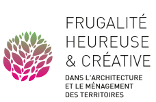
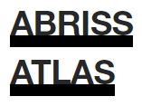

# Inspirations

- [French Frugality Map](https://frugalite.org/ressources/cartographie/)
- [Swiss Material Archive](https://materialarchiv.ch)
- [Swiss Atlas of Demolition](https://abriss-atlas.ch)
- [Re-Use Mapping in Benelux and France](https://opalis.eu)

  
  
  
  

