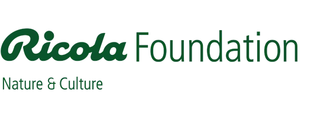

# Supports

- [Ricola Foundation](https://www.ricolafoundation.org/regeneratives-bauen)
- [La Matériauthèque MATILDA](https://materiautheque.ch/)
- [Open Research Data Program of the ETH Board](https://ethrat.ch/en/eth-domain/open-research-data/)
- [Innovation cheque by Innosuisse](https://www.innosuisse.admin.ch/en/innovation-cheque)
- [The Swiss Data Science Center](https://www.datascience.ch/)
- [Innosuisse Flagship Project *Think Earth*](https://thinkearth.ethz.ch/en/the-project.html)

  
  
  
  
  
    

