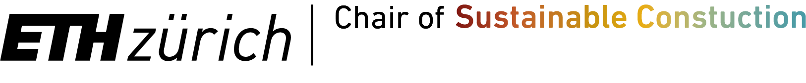
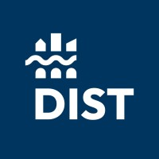
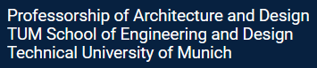

# Who we are

The Atlas of Regenerative Materials originates as a project from the Chair of Sustainable Construction at ETH Zurich, led by Professor Guillaume Habert.

The project was made possible thanks to the initial support of the Ricola Foundation, and the ETH Domain Open Research Data Program .

The Atlas is currently developed in collaboration with Shoshana Huber, a mechanical engineer and craftswoman specialized in sustainable construction, Alia Bengana, an architect, educator, author specialized in regenerative materials, Rome Villa Medicis fellow 2025-2026, Yannick Marcon, web developer from ENAC-IT4R at EPFL, and the designers at Undo-Redo.

Additionally, that Atlas benefits from a network of partners to support our bioregional approach: Prof. Andrea Bocco and his team at the Politecnico Torino as well as Prof. Niklas Fanelsa and his team from TU München joined our efforts.

We all are in regular contact with leading experts from industry, philanthropy, media and academia to maintain the rigor and quality of the Atlas of Regenerative Materials.

The backbone of the Altas is its community of users: a warm thank you to all contributors, reviewers and administrators!

  
  
  

